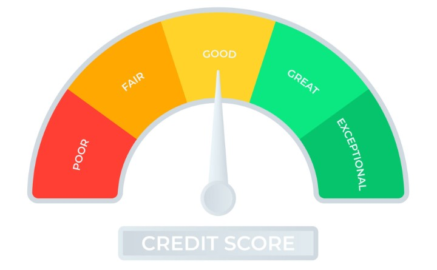
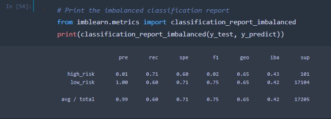
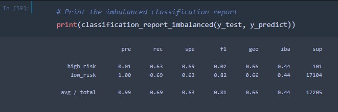
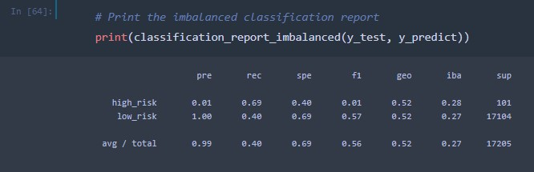
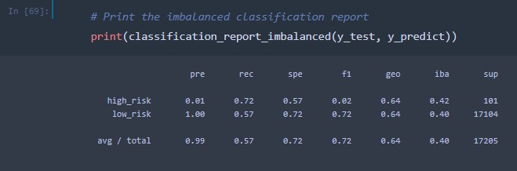
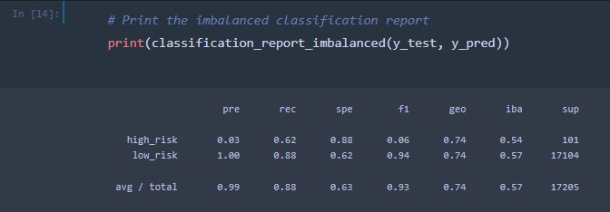
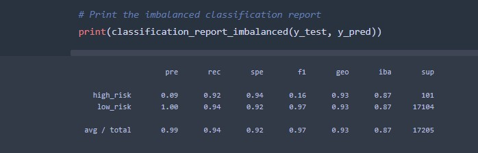

# Credit_Risk_Analysis
 
## Evaluating the performance of machine learning models to determine the best model to predict credit risk with Python.

### Project Overview

Credit risk is the likelihood of a lender’s potential loss resulting from a borrower’s failure to repay a loan or meet a contractual obligation. It is calculated by subtracting liabilities from total assets and is managed in part by lenders using measurement tools to quantify these risks and mitigate potential loss.  Machine learning algorithms are used by lenders to leverage large datasets and reveal patterns, returning meaningful recommendations that determine borrowers’ risk.  

The purpose of this project was to utilize statistic algorithms with supervised machine learning to predict data patterns, in this instance, to calculate credit risk. The data set from the LendingClub was used that’s data had an unbalanced classification problem, that is, the number of “good loans” outweighed the number of “risky loans”. To balance the classifications so meaningful predictions could be made, machine learning algorithms were used to resample the data and improve the accuracy score. 

In this analysis, six different models were tested and compared against each other using a data set from 2019 provided by the LendingClub to uncover which model is the best at predicting credit risk. The algorithms used are outlined below: 

* EasyEnsembleClassifier: The classifier is an ensemble of AdaBoost learners trained on different balanced boostrap samples. The balancing is achieved by random under-sampling (bias reduction model).
* BalancedRandomForestClassifer: A balanced random forest randomly under-samples each boostrap sample to balance it (bias reduction model).
* SMOTE: (Synthetic Minority Oversampling Technique), Addresses imbalanced datasets by oversampling the minority class. New examples are then synthesized from the existing examples
* SMOTEENN: Combines the SMOTE ENN (Edited Nearest Neighbours) algorithms. The minority class is oversampled; however, an undersampling step is added, removing some of each class's outliers from the dataset. The result is that the two classes are separated more cleanly. 
* RandomOverSampler: In random undersampling, randomly selected instances from the majority class are removed until the size of the majority class is reduced, typically to that of the minority class. The dataset used in this example contains information on credit card default.
* ClusterCentroids: Cluster centroid undersampling is akin to SMOTE. The algorithm identifies clusters of the majority class, then generates synthetic data points, called centroids, that are representative of the clusters. The majority class is then under sampled down to the size of the minority class.

### Resources

#### Data Sets

* LoanStats_2019Q1.csv (from the LendingClub.com)

#### Software

* Python 3.7.9, Dependencies: Pandas 1.3.5, SciKit-Learn 1.0, Imabalanced-Learn 0.9.0, 
* Anaconda 2022.10
* Jupyter Notebook 6.4.12

### Results

The dataset utilized for this analysis contained a total of 115,675 loan applications in the first quarter of 2019 from the LendingClub, a peer-to-peer lending services company based out of San Francisco, CA. The loan status was used to determine whether applications were considered low or high risk. Applications with current loan statuses were classified as low risk and all remaining applications were classified as high risk. This filtering process reduced the dataset to only 68,817 total applications to be analyzed, 99% percent of which were classified as being low risk. 

The data was split for training versus testing using the 75/25% method, testing 51,366 applications as being low risk and 246 applications as being high risk.

#### RandomOverSampler Results

The balanced accuracy test returned 66%. 

* Balanced Accuracy: 0.6573009382322703
* Precision: high risk has low positivity, low risk has high possibility. 
* Recall – High/Low risk: 71%/60% (AVG 60%)

#### SMOTE (Synthetic Minority Oversampling Technique)

The accuracy score of the SMOTE oversampling test returned 66.2%.

* Balanced Accuracy: 0.6622479600626106
* Precision: high risk has low positivity; low risk has high possibility. 
* Recall: High/Low risk = 63%/69% (AVG 69%)

#### ClusterCentroids

The undersampling results returned a balanced accuracy score of 66.2%.

* Balanced Accuracy: 0.6622479600626106
* Precision: The precision is low for High-risk loans and is high for Low-risk loans.
* Recall: High/Low risk = 69%/40% (Avg 40%)

#### SMOTEENN (Synthetic Minority Oversampling Technique + Edited NearestNeighbors)

The combination results returned a balanced accuracy score of 54.4%.

* Balanced Accuracy: 0.5442661782548694
* Precision: The precision is low for High-risk loans and is high for Low-risk loans.
* Recall: High/Low risk = 72%/57% (AVG 57%)

#### BalancedRandomForestClassifer

The Balanced Random Forest Classifier results returned an accuracy score of 75.4%.

* Balanced Accuracy: 0.7541461553779325
* Precision: The precision is low for High-risk loans and is high for Low-risk loans.
* Recall: High/Low risk = 62%/88% (88% AVG)

#### EasyEnsembleClassifier

The Easy Ensemble AdaBoost Classifier results returned an accuracy score of 93.1%.

* Balanced Accuracy: 0.9319231677611166
* Precision: The precision is low for High-risk loans and is high for Low-risk loans.
* Recall: High/Low risk = 92%/94% (94% AVG)

### Conclusion

Overall, the Easy Ensemble AdaBoost Classifier algorithm displayed the best balance of all the models tested due to it’s high accuracy score (93%) and good balance of precision and recall scores. All other algorithms tested returned accuracy scores less than 80%. The Easy Ensemble AdaBoost Classifier also returned the highest recall score, also known as the sensitivity rate, determining that it is the best machine learning model tested in this analysis. 

